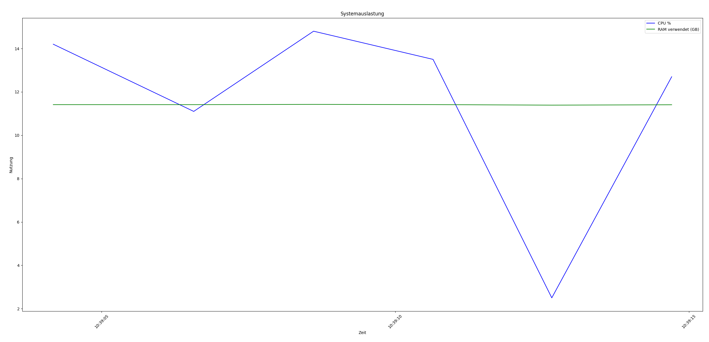

---

# Dokumentation: Power-Statistiken und Systemauslastungsgraf

## 1. Speicherung der Power-Statistiken

### Aufbau der MongoDB-Verbindung

```python
client = MongoClient("mongodb://localhost:27017")
db = client["power_stats"]
collection = db["logs"]
```

* Verbindet sich mit der lokalen MongoDB-Instanz
* Nutzt die Datenbank `power_stats` und die Collection `logs`

---

### Aufbau des gespeicherten Log-Dokuments

```python
{
    "cpu": self.cpu,
    "ram_total": self.ram_total,
    "ram_used": self.ram_used,
    "timestamp": self.timestamp
}
```

* `cpu`: CPU-Auslastung in Prozent
* `ram_total`: Gesamtspeicher (RAM) in Bytes
* `ram_used`: Belegter RAM in Bytes
* `timestamp`: Zeitpunkt der Messung

---

### Zyklische Speicherung mit Timer

```python
while True:
    log_power_stats()
    time.sleep(1)
```

* Führt jede Sekunde eine neue Messung durch
* Die Daten werden in der Datenbank protokolliert

---

## 2. Visualisierung der Power-Statistiken

### Erstellung des Diagramms

```python
plt.figure(figsize=(12, 6))
plt.plot(timestamps, cpu_values, label="CPU %", color="blue")
plt.plot(timestamps, ram_used, label="RAM verwendet (GB)", color="green")
plt.xlabel("Zeit")
plt.ylabel("Nutzung")
plt.title("Systemauslastung")
plt.legend()
plt.xticks(rotation=45)
plt.tight_layout()
```

* Visualisiert CPU- und RAM-Nutzung über die Zeit
* X-Achse: Zeitstempel, Y-Achse: Auslastung
* Darstellung als Liniendiagramm

---

### Speicherung des Diagramms als PNG

```python
plt.savefig("graph.png")
```

* Das Diagramm wird als Bilddatei gespeichert
* Die Datei trägt den Namen `graph.png` und liegt im Arbeitsverzeichnis

---

### Beispielhafte Ausgabe beim Testen der Anwendung

Das folgende Bild zeigt eine beispielhafte Darstellung der Systemauslastung:

Die PNG-Datei befindet sich im Ordner der Aufgabe 5:

```
graph.png
```



